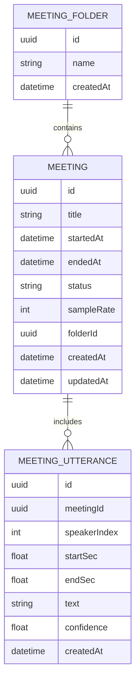

# ✨ feat: Add local meeting dictation with diarized transcripts and folders

## Overview

Add a new **Meetings** experience to Flux for **live meeting capture** (v1), producing **speaker-diarized transcripts** fully on-device using:

- existing **Parakeet** transcription in Flux
- **mlx-audio-swift Sortformer diarization** (inspired by PR #33)

User decisions captured during refinement:
- v1 scope: **Live capture only** (no file import yet)
- UI placement: **New Island header button** (next to Dictation/History)
- Organization: **Separate meeting folders** (not shared with chat folders)

---

## Problem Statement

Flux already supports dictation, but it is optimized for short commands, not long meetings:

- `DictationManager` enforces short session limits (`maxContinuousRecordingDuration = 45`) in `Flux/Sources/Services/DictationManager.swift:64`
- Existing dictation history stores plain entries in `~/.flux/dictation/history.json` via `DictationHistoryStore` (`Flux/Sources/Services/DictationHistoryStore.swift:12`)
- UI has `DictationHistoryView`, but no dedicated meeting timeline/workspace (`Flux/Sources/Views/IslandView.swift:685`, `:819`)
- Current Parakeet path is batch-oriented (`ParakeetTranscriber` notes streaming is future work in `Flux/Sources/Services/Parakeet/ParakeetTranscriber.swift:14-15`)

Users need a Granola-like flow for meetings, but with strict local-first processing and folder organization.

---

## Research Summary

### Local codebase findings

- Existing voice pipeline and engine selection:
  - `VoiceInputMode.parakeetOnDevice` in `Flux/Sources/Services/VoiceInput.swift:7`
  - Parakeet completion path in `Flux/Sources/Services/VoiceInput.swift:573`
- Dictation persistence and metadata model:
  - `DictationEntry` structure in `Flux/Sources/Models/DictationEntry.swift:3`
  - History store path and cap in `Flux/Sources/Services/DictationHistoryStore.swift:7-12`
- Existing folder patterns (chat-only today):
  - `ChatFolder` in `Flux/Sources/Models/ChatFolder.swift:5`
  - Folder operations in `ConversationStore.createFolder/moveConversation` at `Flux/Sources/Models/Conversation.swift:949`, `:976`
  - Folder UI patterns in `Flux/Sources/Views/ChatHistoryView.swift:103-216`
- Island navigation pattern supports adding new content modes:
  - `IslandContentType` and header button wiring in `Flux/Sources/Views/IslandView.swift:11`, `:685`, `:819`

### Institutional learnings

- No `docs/solutions/` directory found in this repo (no stored implementation learnings to reuse directly).

### External research (performed due new dependency + audio/ML uncertainty)

- Diarization feature reference PR:
  - `Blaizzy/mlx-audio-swift` PR #33: https://github.com/Blaizzy/mlx-audio-swift/pull/33
- Key API patterns from that implementation:
  - `DiarizationSegment` / `DiarizationOutput` / RTTM output in
    `Sources/MLXAudioVAD/VADOutput.swift`
  - `SortformerModel.generate`, `feed`, and `generateStream` with threshold/minDuration/mergeGap in
    `Sources/MLXAudioVAD/Models/Sortformer/Sortformer.swift`
- Package dependency surface for VAD module:
  - `MLXAudioVAD` target in `Package.swift`
- Platform audio capture note:
  - ScreenCaptureKit `SCStreamConfiguration.capturesAudio` documentation:
    https://developer.apple.com/documentation/screencapturekit/scstreamconfiguration/capturesaudio
- Granola behavior benchmark (product positioning):
  - “transcribes your computer’s audio directly, no meeting bots” from https://www.granola.ai/

### Related work in Flux history

- `feat: Parakeet TDT v3 on-device transcription engine (#71)`
- `feat(ui): add live transcript dropdown during dictation (#73)`
- `fix: reliable text insertion for keybound dictation`

---

## SpecFlow Analysis (manual)

### Primary flow
1. User starts meeting capture from new Meetings UI.
2. Flux captures audio continuously (local).
3. Audio is chunked and processed in background:
   - diarization (Sortformer)
   - transcription (Parakeet)
4. Transcript timeline updates incrementally with speaker labels.
5. User ends meeting; transcript is finalized and saved.
6. User can assign/move meeting to meeting folders.

### Gaps identified (now included in plan)
- How to handle long sessions without memory growth
- Speaker label stability across chunks
- Permission-denied fallback behavior (mic/screen audio)
- Recovery after app restart during active meeting
- Folder delete behavior for assigned meetings
- Handling low-confidence/no-speech segments

### Edge cases
- Single-speaker meeting should not create spurious speaker switches
- Overlapping speakers in same window
- Meeting audio source unavailable mid-session
- Very long meetings (60–180 min)
- User closes island while capture is active

---

## Proposed Solution

Implement a new Meetings subsystem with dedicated models, store, pipeline, and UI.

### Architecture

#### 1) Capture + processing pipeline (local-only)

- New service: `Flux/Sources/Services/Meetings/MeetingCaptureManager.swift`
- Responsibilities:
  - start/stop session
  - segment rolling PCM buffers into chunks
  - dispatch diarization + transcription jobs off main actor
  - publish incremental utterances to UI

- New service: `Flux/Sources/Services/Meetings/MeetingTranscriptionPipeline.swift`
- Responsibilities:
  - run diarization (`SortformerModel`)
  - run Parakeet transcription per diarized segment (or fallback chunk-level)
  - merge/normalize speaker segments

#### 2) Data model + persistence

- New models:
  - `Flux/Sources/Models/Meeting.swift`
  - `Flux/Sources/Models/MeetingUtterance.swift`
  - `Flux/Sources/Models/MeetingFolder.swift`

- New store:
  - `Flux/Sources/Services/Meetings/MeetingStore.swift`
  - persistence under `~/.flux/meetings/`
    - `index.json` (meeting summaries + folders)
    - `meetings/<meeting-id>.json` (full transcript timeline)

#### 3) UI integration

- Add new Island content modes:
  - `.meetings`
  - `.meetingDetail(MeetingSummary)`
  - `.meetingFolderDetail(MeetingFolder)`
- Add new header button (beside dictation/history) to open Meetings view.
- New views:
  - `Flux/Sources/Views/Meetings/MeetingsView.swift`
  - `Flux/Sources/Views/Meetings/MeetingDetailView.swift`
  - `Flux/Sources/Views/Meetings/MeetingFoldersView.swift`

---

## ERD (conceptual)

---

## Implementation Phases

### Phase 1: Foundation (capture + model wiring)

**Deliverables**
- [ ] Add package dependency and wrappers for diarization in `Flux/Package.swift`
- [ ] Add `MeetingCaptureManager` in `Flux/Sources/Services/Meetings/MeetingCaptureManager.swift`
- [ ] Add `MeetingTranscriptionPipeline` in `Flux/Sources/Services/Meetings/MeetingTranscriptionPipeline.swift`
- [ ] Add core meeting models in `Flux/Sources/Models/Meeting.swift`, `MeetingUtterance.swift`, `MeetingFolder.swift`

**Success criteria**
- Can start/stop a local meeting session
- Produces at least one persisted transcript segment with speaker label

**Estimated effort**
- 3–5 days

### Phase 2: Meetings UI + folders

**Deliverables**
- [ ] Add Island navigation cases + button in `Flux/Sources/Views/IslandView.swift`
- [ ] Add Meetings list/detail views in `Flux/Sources/Views/Meetings/`
- [ ] Add meeting folder CRUD + assignment UI in `Flux/Sources/Views/Meetings/MeetingFoldersView.swift`
- [ ] Add persistence store in `Flux/Sources/Services/Meetings/MeetingStore.swift`

**Success criteria**
- Meetings list updates in real-time while recording
- Completed meetings can be moved between meeting folders

**Estimated effort**
- 3–4 days

### Phase 3: Quality, resilience, polish

**Deliverables**
- [ ] Add robustness around permissions/recovery in `MeetingCaptureManager.swift`
- [ ] Add transcript export (RTTM/txt) in `Flux/Sources/Services/Meetings/MeetingExportService.swift`
- [ ] Add tests in `Flux/Tests/FluxTests/MeetingStoreTests.swift`, `MeetingPipelineTests.swift`, `MeetingFolderTests.swift`

**Success criteria**
- Stable for 60+ minute sessions
- No data loss on crash/relaunch during active capture

**Estimated effort**
- 2–3 days

---

## Alternative Approaches Considered

1. **Remote diarization/transcription (Deepgram/etc.)**
   - Rejected for v1: conflicts with local-only requirement.

2. **Parakeet-only (no diarization)**
   - Rejected: does not meet “meeting transcription similar to Granola” expectation.

3. **Unify meeting folders with chat folders**
   - Rejected for v1 based on user decision for separate systems and lower migration risk.

---

## Technical Considerations

### Concurrency
- Keep heavy inference off main actor.
- Use bounded task queue for chunk processing to avoid runaway backlog.
- Preserve UI responsiveness in Island panel updates.

### Performance
- Long-session memory control via rolling chunk buffer + incremental persistence.
- Tune chunk size (e.g., 10–20s) for acceptable latency/accuracy tradeoff.

### Privacy/Security
- Store only local transcript artifacts under `~/.flux/meetings/`.
- No network calls for transcription/diarization path.
- Explicit UX messaging for local processing behavior.

### Reliability
- Session journal/checkpoint for recovery after crash.
- Graceful fallback when diarization fails (store transcript with speaker `unknown`).

---

## Acceptance Criteria

### Functional
- [ ] User can start/stop a live meeting capture from new Meetings UI.
- [ ] Transcript appears incrementally during recording.
- [ ] Utterances include speaker labels (`speaker_0`, `speaker_1`, …).
- [ ] Completed meetings persist and are visible after app restart.
- [ ] Meetings can be created/moved/deleted within **meeting folders**.
- [ ] Meetings UI is reachable from a dedicated Island header button.

### Non-Functional
- [ ] 100% local processing for meeting pipeline (no external API calls).
- [ ] UI remains interactive during processing (no visible hangs).
- [ ] 60-minute recording does not exceed agreed memory threshold (define in implementation).

### Quality gates
- [ ] Unit tests for store/model migration paths.
- [ ] Pipeline tests for segment merge/minDuration behavior.
- [ ] Manual QA across permission-denied and permission-revoked paths.

---

## Success Metrics

- **Adoption:** % of active users who create at least one meeting transcript/week
- **Latency:** median time from chunk close to displayed diarized utterance
- **Stability:** crash-free rate during active meeting capture
- **Quality:** internal QA speaker-label correctness target on sampled meetings

---

## Dependencies & Prerequisites

- `mlx-audio-swift` integration with `MLXAudioVAD` support
- Existing Parakeet model readiness flow (`ParakeetModelManager`)
- Microphone permission; optional screen/audio capture permission where system audio is used
- Build/test updates for additional model/runtime requirements

---

## Risk Analysis & Mitigation

- **Risk:** Speaker identity drift between chunks
  - **Mitigation:** cache speaker embeddings/state across chunks; expose post-processing thresholds

- **Risk:** High CPU on older Apple Silicon for long sessions
  - **Mitigation:** adaptive chunk sizing; processing QoS tuning; optional low-power mode

- **Risk:** Large on-disk transcripts
  - **Mitigation:** compressed summary index + per-meeting files; configurable retention limits

- **Risk:** Package/API churn in upstream `mlx-audio-swift`
  - **Mitigation:** pin commit/tag; wrap third-party APIs behind Flux adapter layer

---

## Resource Requirements

- 1 Swift engineer familiar with AVAudioEngine + Swift Concurrency
- 1 engineer/reviewer for MLX/diarization integration
- QA pass on real meeting recordings (multi-speaker + overlap cases)

---

## Documentation Plan

- Update `README.md` with Meetings capability and local-processing guarantee
- Add user-facing help text in Meetings UI (permissions + privacy)
- Add developer docs under `docs/`:
  - `docs/meetings-architecture.md`
  - `docs/meetings-testing.md`

---

## AI-Era Implementation Notes

- AI-assisted scaffolding should be limited to non-sensitive generated boilerplate.
- Human review required for:
  - concurrency boundaries
  - audio pipeline correctness
  - privacy guarantees (local-only invariants)
- Keep a short prompt log in PR description for reproducibility.

---

## References & Research

### Internal references
- `Flux/Sources/Services/DictationManager.swift:63-65,220,362,436,469,749,826`
- `Flux/Sources/Services/VoiceInput.swift:7,55,573,603`
- `Flux/Sources/Services/Parakeet/ParakeetTranscriber.swift:14-15,62,69-70`
- `Flux/Sources/Services/DictationHistoryStore.swift:5,7,12,16`
- `Flux/Sources/Views/IslandView.swift:11,615,685,716,819`
- `Flux/Sources/Views/ChatHistoryView.swift:103,108,181,280,358`
- `Flux/Sources/Models/Conversation.swift:193-201,949,976`
- `Flux/Sources/Models/ChatFolder.swift:5,22,28`

### External references
- PR: https://github.com/Blaizzy/mlx-audio-swift/pull/33
- Diarization output API: https://github.com/Blaizzy/mlx-audio-swift/blob/main/Sources/MLXAudioVAD/VADOutput.swift
- Sortformer API docs: https://github.com/Blaizzy/mlx-audio-swift/blob/main/Sources/MLXAudioVAD/Models/Sortformer/README.md
- Package target wiring: https://github.com/Blaizzy/mlx-audio-swift/blob/main/Package.swift
- ScreenCaptureKit audio capture: https://developer.apple.com/documentation/screencapturekit/scstreamconfiguration/capturesaudio
- Product behavior inspiration: https://www.granola.ai/

### Related work
- Flux commits:
  - `f297076` (Parakeet TDT v3 on-device transcription)
  - `4183008` (live transcript dropdown)
  - `2a91666` (dictation insertion reliability)

---

## Open Questions

1. Should v1 capture **mic only** or **mic + system audio** by default when both permissions are available?
2. Should we expose diarization tuning controls (`threshold`, `minDuration`, `mergeGap`) in Settings v1 or keep internal defaults?
3. Do we need transcript export formats in v1 (txt/RTTM), or defer to v1.1?
